# Artifact Hub 📜🏺

The **Artifact Hub** is an interactive platform designed to catalog and explore the world's most fascinating historical artifacts. Whether you're an enthusiast of ancient tools, documents, or relics, this site allows you to browse, contribute, and learn more about artifacts from across history.

---

## 🚀 Live Demo

[Live Website](https://artifacts-hub-schr0smi1ey.web.app/)

---

## 🌟 Key Features

### **🔒 User Authentication**

- 🔑 Secure login and registration via **Email/Password** or **Google Sign-In**.
- 🔐 Authentication powered by **Firebase** for safe and reliable user access.

### **📜 Artifact Management**

- ➕ **Add Artifact**: Protected route to add artifacts, complete with form validation.
- ✏️ **Update/Delete Artifacts**: Edit or remove user-added artifacts with ease.
- 🖼️ **View All Artifacts**: Explore a gallery of artifacts with concise descriptions.
- 🔍 **Artifact Details**: Dive deeper into an artifact’s historical context and details.
- ❤️ **Like Artifacts**: Toggle like functionality to express interest in artifacts.
- 🗂️ **My Artifacts**: Manage artifacts you’ve contributed in a dedicated section.

### **⚡ Real-Time CRUD Operations**

- 🔄 **MongoDB** integration for managing all artifact data.
- 🎉 Instant feedback with toast notifications or Sweet Alerts for all actions.

### **🛡️ Protected Routes**

- 🔑 Access private pages only after login, ensuring secure interaction.
- 🚪 Automatic redirection to the login page for unauthorized users.

### **📱 Responsive Design**

- 💻📱 Optimized for mobile, tablet, and desktop using **Tailwind CSS**.

### **🎨 Enhanced User Experience**

- 🚀 Smooth navigation with React Router.
- ✨ **Animations**:
  - 🎥 Scroll animations with **AOS**.
  - 🎭 Effects using **React Awesome Reveal**.
- 🖋️ **Typewriter Effect**: Dynamic text animations with **React Simple Typewriter**.
- 🔎 **Search Functionality**: Locate artifacts by name effortlessly.

---

## ⚙️ Technologies Used

### **Frontend**

- ⚛️ **React.js**: For a fast and intuitive UI.
- 🎨 **TailwindCSS**: For responsive and attractive styling.

### **Backend and Authentication**

- 🌐 **Node.js**: Backend framework.
- 📡 **Express.js**: RESTful API handling.
- 🗃️ **MongoDB**: NoSQL database for storing artifact data.
- 🔐 **JWT**: For secure authentication and private route handling.

### **Utilities and Libraries**

- 🔄 **React Router**: For efficient page routing.
- 📦 **Axios**: For making API calls to the backend.
- **npm Packages**:
  - **React CountUp**: For smooth animations in counting values or statistics.
  - **React Toastify**: For displaying notification messages to users.
  - **React Helmet**: For managing document head tags and SEO optimization.
  - **React Icons**: For adding icons to the application.
  - **React Spinners**: For adding loading spinners to the application.
  - **React Simple Typewriter**: For dynamic text animations.
  - **Sweet Alerts**: For custom alerts and notifications.
  - **AOS (Animate On Scroll)**: For adding scroll-based animations.
  - **React Awesome Reveal**: For revealing elements with animations.
  - **React Select**: For custom dropdowns and select components.

### **Development Tools**

- 🖥️ **Visual Studio Code**: Development environment.
- 🛠️ **GitHub**: Version control and collaboration.
- 🚀 **Vercel**: For deploying the backend server.
- 📦 **firebase**: For deploying the frontend application.

---

## 🎥 Screenshots

### 🏠 Home Page

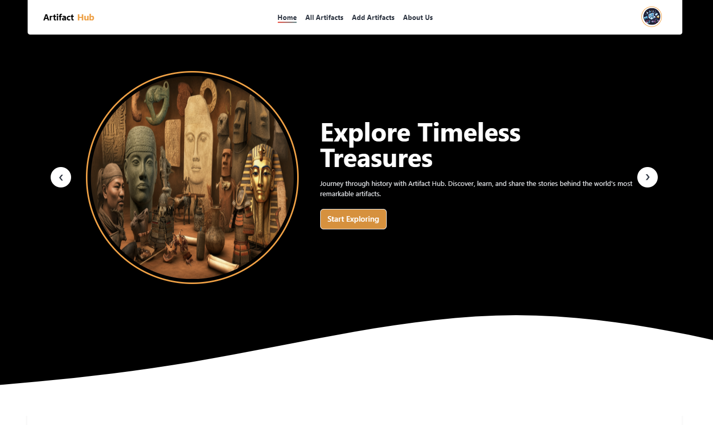

### 🔑 Login Page

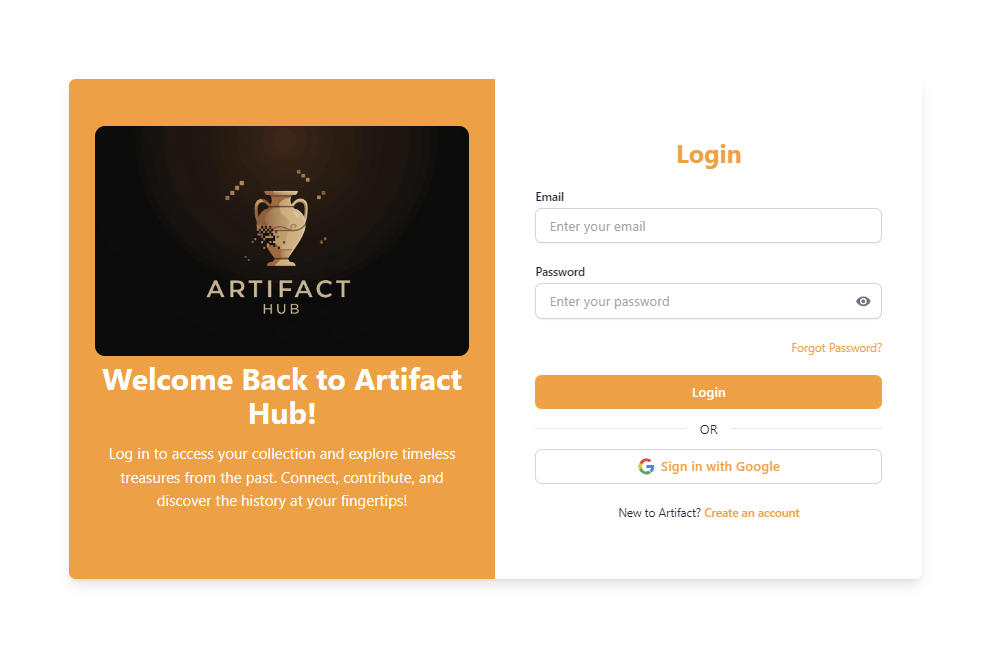

### 🖊️ Registration Page

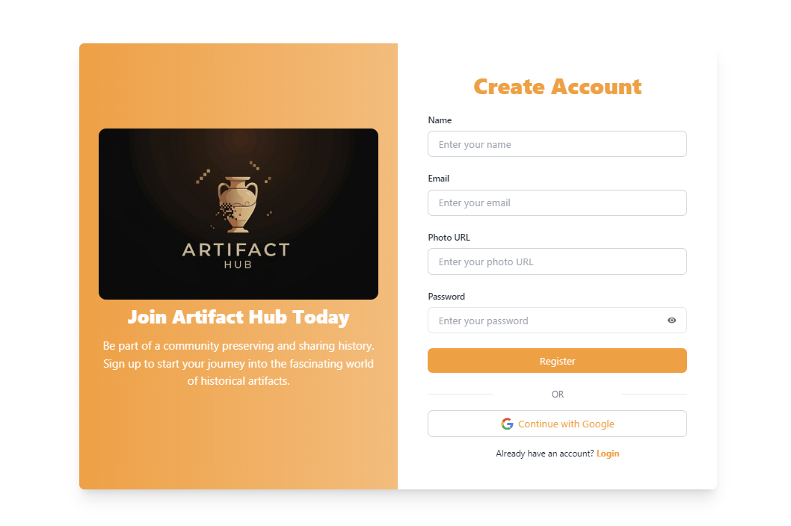

### 📜 All Artifacts Page

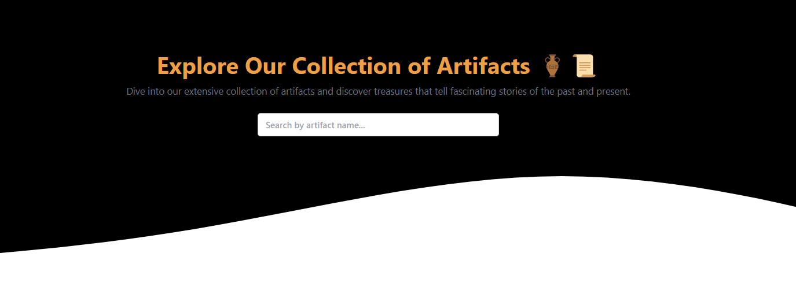
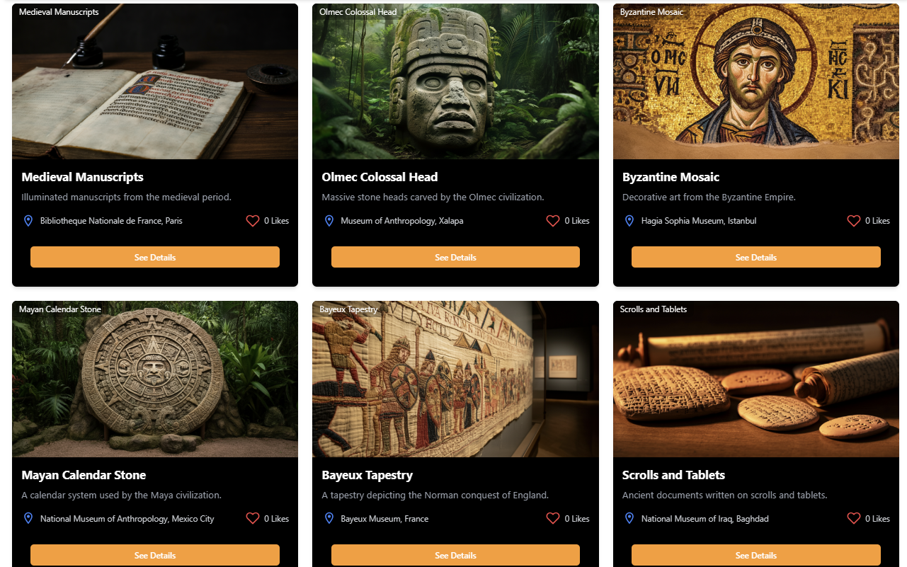

### 🖼️ Artifact Details Page

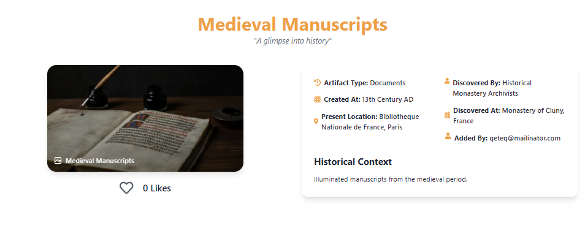

### ➕ Add Artifact Page

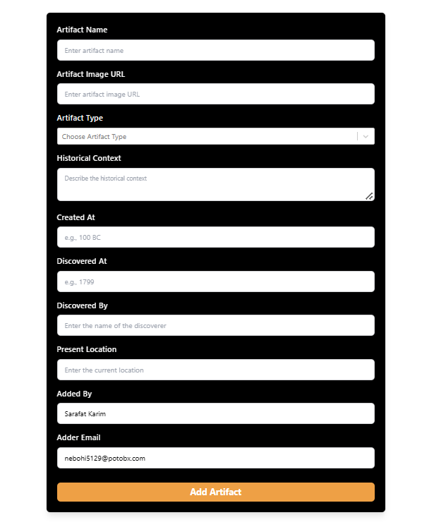

### About Page

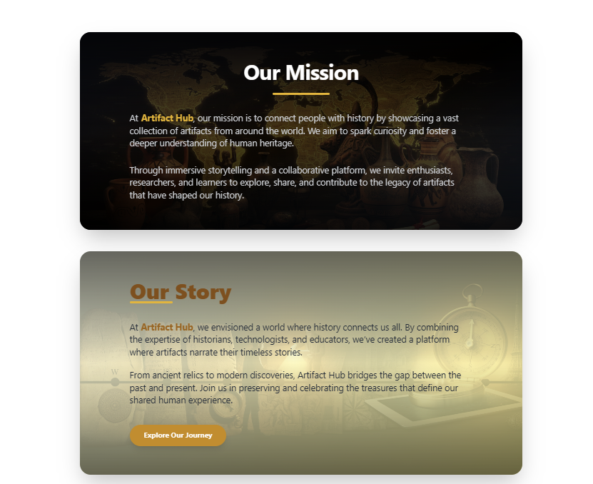

### My Artifacts Page

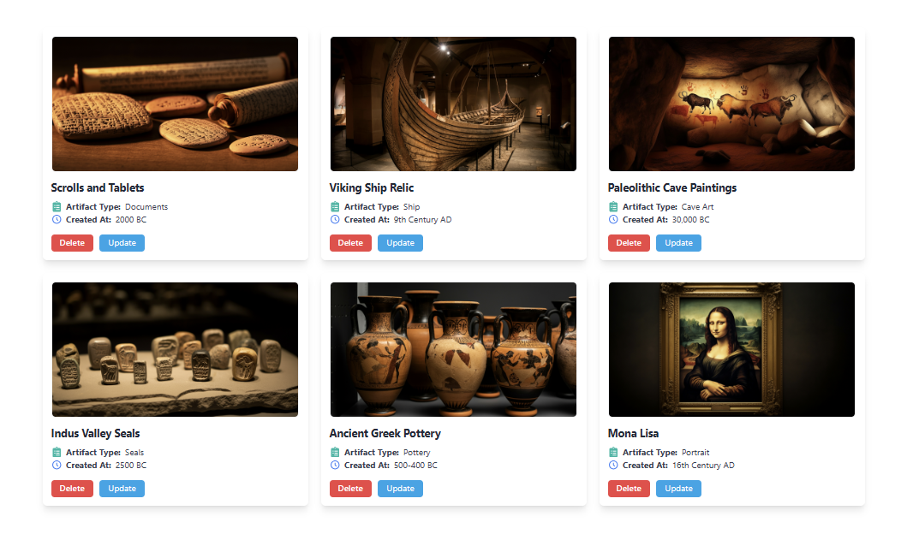

### Update Artifact Page

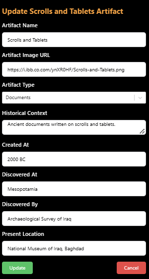

### Like Artifacts Page

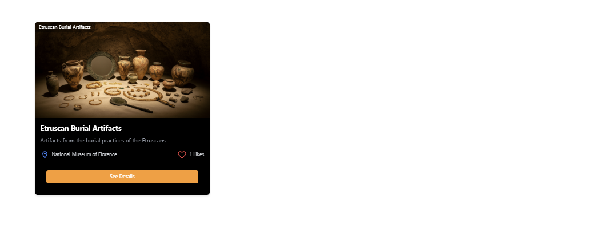

---

## 🤝 Contributing

Contributions are welcome! Follow these steps:

1. 🍴 Fork the repository.
2. 🌱 Create a new branch (`git checkout -b feature-name`).
3. 🛠️ Make changes and commit (`git commit -m 'Add new feature'`).
4. 🚀 Push to your forked repository (`git push origin feature-name`).
5. 📩 Create a pull request.

---

Built with 💙 and curiosity for history by [Sarafat Karim](https://www.linkedin.com/in/sarafat-karim/)
